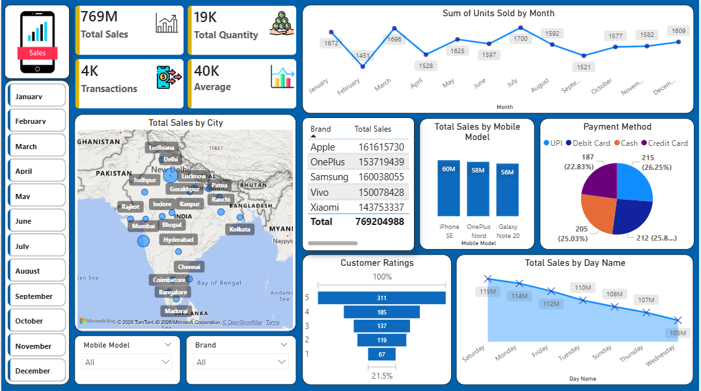

# 📊 Mobile Sales Data Dashboard - Power BI

Mobile Sales Data Dashboard created using Microsoft Power BI. Includes sales analysis, customer insights, payment methods, city-wise performance, and interactive visualizations.

This project is a Mobile Sales Data Dashboard created using Microsoft Power BI.

## 🚀 Features
- Total Sales Analysis
- Transactions & Quantity Tracking
- City-wise Sales Insights
- Brand Performance Comparison
- Monthly Sales Trends
- Payment Method Analysis
- Customer Ratings Visualization
- Interactive Dashboard Filters

## 🛠 Tools Used
- Microsoft Power BI
- Data Visualization
- Business Intelligence Techniques

## 📷 Dashboard Preview

## 📚 Learning Source
This project was created while learning Power BI through SkillCourse under the guidance of Satish Dhawale.

## 🎯 Project Purpose
The purpose of this dashboard is to analyze mobile sales data and generate meaningful business insights using interactive visualizations.

## 👨‍💻 Author
Bhushan Khade
